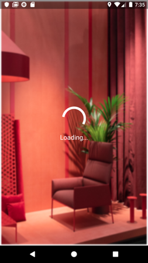
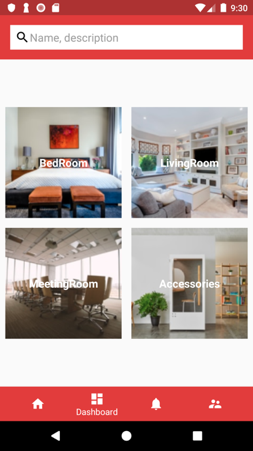
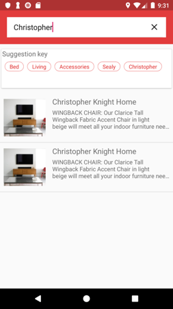
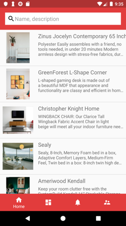
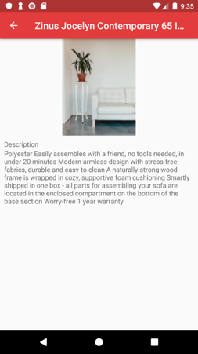

# Furniture App
## Lab 01
<table border="0">
<tr>
<td>

</td>
<td>

</td>
<td>

</td>
<td>

</td>
</tr>
</table>

## Lab 02,03
<table border="0">
<tr>
<td>

</td>
<td>

</td>
<td>

</td>
</tr>
</table>

## Lab 04,05
<table border="0">
<tr>
<td>

</td>
<td>

</td>
<td>

</td>
<td>

</td>
<td>

</td>
</tr>
</table>  
# Lab 06
